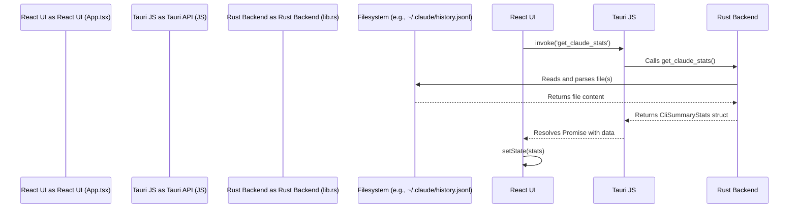

# OpenTokenMonitor Architecture

This document provides a detailed overview of the technical architecture of OpenTokenMonitor, a Tauri-based desktop application designed to monitor AI API and CLI tool usage.

## 1. High-Level Overview

OpenTokenMonitor is a hybrid application that combines a Rust backend for local data processing with a React/TypeScript frontend for the user interface. It operates using two primary data sources:

1.  **Local File Parsing:** The Rust core reads and parses history and statistics files from the local filesystem, generated by tools like the Claude CLI, Codex CLI, and Gemini CLI.
2.  **Live API Fetching:** The frontend directly queries the public APIs of providers (Anthropic, OpenAI, Google) to fetch real-time usage data and validate API keys.

The application is built on the [Tauri](https://tauri.app/) framework, which allows the web-based frontend to run in a native webview while the Rust backend runs as a privileged, co-located process. This architecture provides the performance and system access of a native application alongside the rapid development and rich UI capabilities of web technologies.

### High-Level Architecture Diagram

```mermaid
graph TD
    subgraph Frontend (Tauri Webview)
        direction LR
        A[React UI Components]
        B[API Services (api.ts)] -- HTTP Requests --> C[External Provider APIs]
        D[Tauri API Wrappers] -- IPC --> E[Rust Backend]
        A -- Calls --> B
        A -- Calls --> D
    end

    subgraph Backend (Tauri Core)
        direction LR
        E[Rust Backend] -- Reads/Watches --> F[Local Filesystem (.claude, .codex, .gemini)]
    end

    C -- (Anthropic, OpenAI, Google) --> B
    F -- (History, Stats) --> E

    classDef webview fill:#D6EAF8,stroke:#2980B9
    classDef rustcore fill:#D5F5E3,stroke:#229954
    class A,B,D webview
    class E,F rustcore
```

---

## 2. Core Technologies

-   **Application Framework:** [Tauri](https://tauri.app/)
-   **Backend:** [Rust](https://www.rust-lang.org/)
    -   **Key Crates:** `serde` (serialization), `notify` (file watching), `tauri`
-   **Frontend:** [React](https://reactjs.org/) with [TypeScript](https://www.typescriptlang.org/)
    -   **Build Tool:** [Vite](https://vitejs.dev/)
    -   **UI Components:** Custom components, `lucide-react` for icons.
-   **Communication:** Tauri's Inter-Process Communication (IPC) bridge (`invoke`, `emit`, `listen`).
-   **Data Persistence:** `@tauri-apps/plugin-store` for saving user configuration to a JSON file.
-   **HTTP Requests:** `@tauri-apps/plugin-http` for making external API calls from the frontend.

---

## 3. Project Structure

The codebase is split into two main directories:

-   `src/`: Contains all frontend code (React, TypeScript, CSS).
-   `src-tauri/`: Contains all backend code (Rust).

| Path                 | Description                                                                                                                              |
| -------------------- | ---------------------------------------------------------------------------------------------------------------------------------------- |
| `src/`               | The React frontend application.                                                                                                          |
| `src/components/`    | Reusable React components that form the UI.                                                                                              |
| `src/services/`      | Modules for interacting with data sources. `api.ts` calls external APIs, while other files interact with the Rust backend via IPC.         |
| `src/App.tsx`        | The root component of the React application, responsible for state management and orchestrating data fetching.                             |
| `src-tauri/`         | The Rust backend application.                                                                                                            |
| `src-tauri/src/lib.rs` | The core backend logic, including Tauri command definitions, file watchers, and data parsing.                                            |
| `src-tauri/src/main.rs`| The entry point for the native application, which simply bootstraps and runs the library code in `lib.rs`.                                 |
| `tauri.conf.json`    | The main configuration file for the Tauri application, defining permissions, plugins, and window properties.                               |

---

## 4. Backend Architecture (`src-tauri`)

The Rust backend is responsible for all privileged operations and direct filesystem access.

### Key Responsibilities:

1.  **Exposing Commands:** It defines several `#[tauri::command]` functions that can be invoked from the frontend. These commands read local files, parse them, and return structured data.
    -   `get_claude_history`, `get_codex_history`
    -   `get_claude_stats`, `get_codex_stats`, `get_gemini_stats`
    -   `get_claude_usage_cache`, `get_usage_windows`
2.  **File System Watching:** It spawns background threads to watch the relevant directories (`~/.claude`, `~/.codex`, `~/.gemini`). When a file changes, it re-parses the data and uses `app.emit()` to send an event to the frontend, enabling a real-time UI.
3.  **System Tray Management:** It creates and manages the application's system tray icon and context menu (Show/Hide, Quit).

---

## 5. Frontend Architecture (`src`)

The frontend is a single-page application built with React.

### Key Responsibilities:

1.  **UI Rendering:** Manages the user interface, which is composed of several React components for displaying stats, charts, and activity feeds.
2.  **State Management:** The main `App.tsx` component holds all application state in React hooks (`useState`). It fetches data on load and updates the state, triggering re-renders.
3.  **Data Orchestration:** It orchestrates calls to both the Rust backend (via `invoke`) and external provider APIs (via `fetch`). It merges this data to provide a comprehensive view. For example, it fetches live rate-limit data from Anthropic but falls back to local CLI history stats (from Rust) for OpenAI.
4.  **Event Listening:** It uses `listen` to subscribe to events from the backend, allowing it to update the UI in real-time when local files change.
5.  **Configuration Management:** It handles loading and saving user settings (API keys, refresh interval) to a local `config.json` file using the `tauri-plugin-store`.

---

## 6. Communication and Data Flow

Communication between the frontend and backend is central to the application's design. There are two main data flow patterns.

### Flow 1: Fetching Local CLI Stats (Frontend-Initiated)

This flow is used to load historical data when the application starts or is manually refreshed.



### Flow 2: Real-time Updates (Backend-Initiated)

This flow pushes updates to the UI when local CLI tool usage is detected.

```mermaid
sequenceDiagram
    participant User
    participant CLI Tool as CLI Tool (e.g., 'claude')
    participant Filesystem
    participant Watcher as File Watcher (Rust Thread)
    participant Rust Backend as Rust Backend (Main Thread)
    participant Tauri JS as Tauri API (JS)
    participant React UI as React UI (App.tsx)

    User->>CLI Tool: Runs a command
    CLI Tool->>Filesystem: Appends to history.jsonl
    Watcher->>Watcher: Detects file change
    Watcher->>Rust Backend: Emits event with new line data
    Rust Backend->>Tauri JS: emit('cli-activity', payload)
    Tauri JS->>React UI: Fires 'cli-activity' event listener
    React UI->>React UI: Updates state with new activity
```

### Flow 3: Fetching Live Provider API Data

This flow is used to get real-time token usage from provider APIs that support it.

```mermaid
sequenceDiagram
    participant React UI as React UI (api.ts)
    participant Tauri HTTP as Tauri HTTP Plugin
    participant Provider API as Provider API (e.g., api.anthropic.com)

    React UI->>Tauri HTTP: fetch('https://api.anthropic.com/...')
    Tauri HTTP->>Provider API: Makes external HTTP POST request
    Provider API-->>Tauri HTTP: Returns response with usage in headers
    Tauri HTTP-->>React UI: Resolves Promise with response
    React UI->>React UI: Parses headers and sets usage state
```
