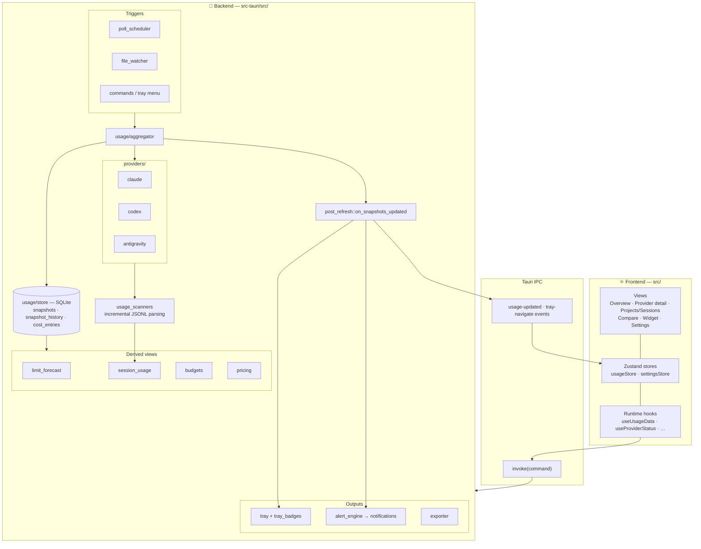
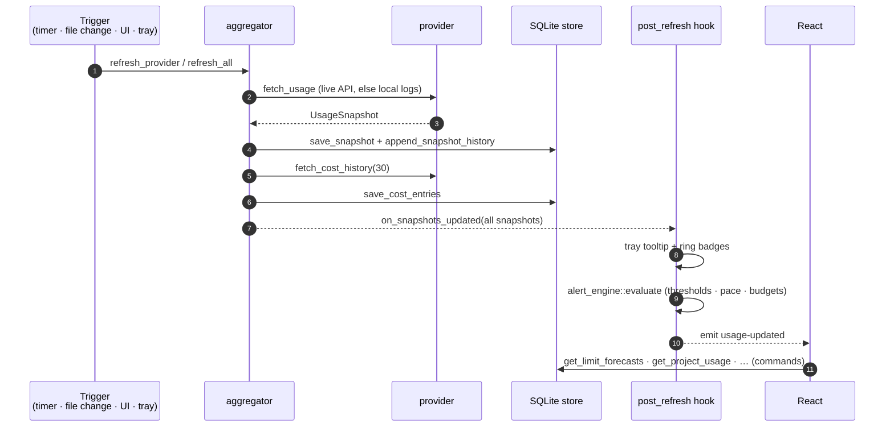

# OpenTokenMonitor Architecture

This document explains how the current codebase is wired together and where to
start when changing behavior. It is written for contributors who need a quick,
accurate map of the runtime instead of a marketing overview.

## 1. System Shape

OpenTokenMonitor is a Tauri desktop app with:

- a React + TypeScript frontend in `src/`
- a Rust backend in `src-tauri/src/`
- a SQLite persistence layer managed by the Rust backend
- provider adapters that combine local CLI artifacts with live authenticated fetches

```mermaid
flowchart TB
  subgraph FE["⚛️ Frontend — src/"]
    direction LR
    VIEWS["Views<br/>Overview · Provider detail · Projects/Sessions<br/>Compare · Widget · Settings"]
    STORES["Zustand stores<br/>usageStore · settingsStore"]
    HOOKS["Runtime hooks<br/>useUsageData · useProviderStatus · …"]
    VIEWS --- STORES --- HOOKS
  end

  subgraph BRIDGE["Tauri IPC"]
    direction LR
    CMD["invoke(command)"]
    EVT["usage-updated · tray-navigate events"]
  end

  subgraph BE["🦀 Backend — src-tauri/src/"]
    direction TB
    subgraph IN["Triggers"]
      direction LR
      POLL["poll_scheduler"]
      WATCH["file_watcher"]
      MANUAL["commands / tray menu"]
    end
    AGG["usage/aggregator"]
    subgraph PROV["providers/"]
      direction LR
      CLAUDE["claude"]
      CODEX["codex"]
      ANTI["antigravity"]
    end
    SCAN["usage_scanners<br/>incremental JSONL parsing"]
    STORE[("usage/store — SQLite<br/>snapshots · snapshot_history · cost_entries")]
    subgraph DERIVE["Derived views"]
      direction LR
      FC["limit_forecast"]
      SES["session_usage"]
      BUD["budgets"]
      PRICE["pricing"]
    end
    HOOK["post_refresh::on_snapshots_updated"]
    subgraph OUT["Outputs"]
      direction LR
      TRAY["tray + tray_badges"]
      ALERT["alert_engine → notifications"]
      EXP["exporter"]
    end
  end

  HOOKS --> CMD --> BE
  IN --> AGG --> PROV
  PROV --> SCAN
  AGG --> STORE
  STORE --> DERIVE
  SCAN --> SES
  AGG --> HOOK --> TRAY
  HOOK --> ALERT
  HOOK --> EVT --> STORES
```

The important design choice is that the frontend does not talk to provider APIs
directly. The React app talks to the Rust backend through Tauri commands, and
the Rust backend owns provider fetch logic, persistence, background refreshes,
and filesystem watching.

## 2. Runtime Flow

### App startup

1. Tauri starts the Rust backend from `src-tauri/src/main.rs`.
2. `src-tauri/src/lib.rs` builds the Tauri app, initializes plugins, opens the
   SQLite-backed `UsageStore`, registers providers, configures the tray, starts
   file watchers, and starts the poll scheduler.
3. React mounts `src/App.tsx`.
4. `App.tsx` activates:
   - `useGlassTheme` to apply the current theme
   - `useUsageData` to bootstrap usage snapshots and subscribe to backend events
   - `useProviderStatus` to poll provider availability
5. Zustand stores in `src/stores/` become the shared source of truth for the UI.

### Data refresh

```mermaid
sequenceDiagram
  autonumber
  participant T as Trigger<br/>(timer · file change · UI · tray)
  participant A as aggregator
  participant P as provider
  participant S as SQLite store
  participant H as post_refresh hook
  participant UI as React

  T->>A: refresh_provider / refresh_all
  A->>P: fetch_usage (live API, else local logs)
  P-->>A: UsageSnapshot
  A->>S: save_snapshot + append_snapshot_history
  A->>P: fetch_cost_history(30)
  A->>S: save_cost_entries
  A-->>H: on_snapshots_updated(all snapshots)
  H->>H: tray tooltip + ring badges
  H->>H: alert_engine::evaluate (thresholds · pace · budgets)
  H-->>UI: emit usage-updated
  UI->>S: get_limit_forecasts · get_project_usage · … (commands)
```

1. Something triggers a refresh: the poll scheduler, a file watcher, a UI store
   action such as `refreshAll()`, or the tray's *Refresh All*.
2. The trigger calls `src-tauri/src/usage/aggregator.rs`.
3. The aggregator asks the provider for fresh usage (live API first, local logs
   as fallback) and writes the snapshot, a `snapshot_history` row per window,
   and daily per-model costs into SQLite.
4. **Every** refresh path then calls `post_refresh::on_snapshots_updated`, which
   updates the tray (tooltip and ring badges) and runs the alert engine.
5. Rust emits `usage-updated`; `useUsageData` upserts the snapshot and the UI
   re-fetches derived data (forecasts, projects, sessions) for the visible page.

### Background updates

Two backend systems keep the UI current even when the user does not press refresh
(both go through the same post-refresh hook, so badges and alerts stay in sync):

- `src-tauri/src/watchers/poll_scheduler.rs`
  Periodically triggers refreshes based on the configured cadence.
- filesystem watchers under `src-tauri/src/watchers/`
  React to changes in local CLI artifacts and re-run provider refreshes.

## 3. Frontend Structure

### `src/App.tsx`

`App.tsx` is the frontend orchestrator. It is responsible for:

- deciding whether the app is in widget mode or full dashboard mode
- managing current page selection
- kicking off initial fetches
- coordinating refreshes across providers

Long-lived runtime side-effects are delegated to dedicated hooks so `App.tsx`
stays focused on render branching:

| Hook                          | Responsibility                                  |
|-------------------------------|-------------------------------------------------|
| `useUsageData`                | Bootstrap snapshots, listen for `usage-updated` |
| `useProviderStatus`           | Poll provider availability                      |
| `useGlassTheme`               | Apply current theme variables                   |
| `useLaunchAtStartupSync`      | Sync OS autostart entry with persisted setting  |
| `useWidgetResize`             | Resize Tauri window when widget mode toggles    |
| `useKeyboardShortcuts`        | Global keyboard shortcuts (refresh, page nav)   |

If you need to understand "what happens when the app opens?", start here, then
follow the hook into `src/hooks/`.

### `src/stores/usageStore.ts`

This is the main frontend bridge to the backend. It stores:

- current snapshots
- trends
- model breakdowns
- recent activity
- provider status results
- generated alerts and reports

Every action in this store is intentionally thin:

- call a backend command
- normalize the returned shape into per-provider maps
- update Zustand state

If backend data is in the app but not on screen, this is usually the first place to inspect.

### `src/hooks/useUsageData.ts`

This hook handles usage bootstrap and live synchronization:

- tries `refreshAll()` first so the app prefers fresh backend data
- falls back to cached snapshots when refresh fails
- fetches recent activity for every provider
- listens for the backend `usage-updated` event and merges incoming snapshots

### `src/hooks/useProviderStatus.ts`

This hook polls provider availability independently from usage snapshots. That
separation lets the UI distinguish:

- "provider is reachable but usage is still loading"
- "provider is only partially available"
- "provider is unavailable"

### `src/components/`

The main UI surfaces are grouped by responsibility:

- `components/layout/`
  Sidebar, widget mode, widget activity surface
- `components/providers/`
  Overview cards and full provider detail screens
- `components/projects/`
  Projects / Sessions page (exact costs from `get_project_usage` / `get_session_usage`)
- `components/comparison/`
  Compare view (spend share + side-by-side rows built on the overview card styles)
- `components/insights/`
  Cache-hit rate, cache savings and model spend mix on provider pages
- `components/settings/`
  Settings and About panels
- `components/meters/`
  Circular/widget gauges, reset countdowns, the `LimitEta` time-to-limit pill, and usage meters
- `components/states/`
  Empty, loading, error, and diagnostics states

## 4. Backend Structure

### `src-tauri/src/lib.rs`

This file is the backend composition root. It owns:

- the shared `AppState`
- the Tauri builder + plugin wiring (`run`)
- the scheduler restart helper and the file-watcher attach helper

Command handlers, tray, alerts, autostart, and pricing have been split into
their own modules to keep `lib.rs` short. See the module map at the top of
the file for where each concern lives.

| Concern                        | Module                          |
|--------------------------------|---------------------------------|
| Tauri command handlers         | `src-tauri/src/commands.rs`     |
| Post-refresh fan-out (tray, alerts) | `src-tauri/src/post_refresh.rs` |
| Tray icon, menu, tooltip, title | `src-tauri/src/tray.rs`        |
| Menu-bar ring badge rendering  | `src-tauri/src/tray_badges.rs`  |
| Alert bands for reports        | `src-tauri/src/alerts.rs`       |
| Notification decisions (once per escalation, pace, budget) | `src-tauri/src/alert_engine.rs` |
| OS notification delivery       | `src-tauri/src/notifications.rs` |
| Time-to-limit forecast         | `src-tauri/src/limit_forecast.rs` |
| Per-session / per-project usage | `src-tauri/src/session_usage.rs` |
| Budgets + spend forecast       | `src-tauri/src/budgets.rs`      |
| CSV / JSON / HTML export       | `src-tauri/src/exporter.rs`     |
| OS launch-at-startup wrapper   | `src-tauri/src/autostart.rs`    |
| Per-model cost rate tables     | `src-tauri/src/pricing.rs`      |
| Provider implementations       | `src-tauri/src/providers/`      |
| Snapshot persistence (SQLite)  | `src-tauri/src/usage/store.rs`  |
| Refresh orchestration          | `src-tauri/src/usage/aggregator.rs` |
| Local CLI artifact scanning    | `src-tauri/src/usage_scanners.rs` |
| Filesystem + poll watchers     | `src-tauri/src/watchers/`       |

This is the best place to start when a frontend `invoke(...)` call is failing
— `lib.rs` declares all modules, and `commands.rs` owns the actual handlers.

### `src-tauri/src/providers/`

Provider implementations live here. Each provider conforms to the `UsageProvider`
trait in `src-tauri/src/providers/mod.rs`:

- `fetch_usage`
- `fetch_cost_history`
- `check_status`

`registry.rs` is the one place where providers are registered. Adding a new
provider always means:

1. implement the trait
2. register it in `ProviderRegistry::new()`
3. update any frontend provider enums or metadata maps

### `src-tauri/src/usage/aggregator.rs`

The aggregator is deliberately simple. It does not own provider-specific logic.
Its job is to:

- ask a provider for fresh usage
- persist the snapshot
- persist optional cost history
- aggregate provider errors when running `refresh_all`

### `src-tauri/src/usage/store.rs`

This module owns SQLite persistence. It is the durable source for:

- latest snapshots (`snapshots`, one row per provider)
- utilization history (`snapshot_history`, one row per window per fresh fetch,
  pruned to 30 days) — the input to `limit_forecast`
- cost history (`cost_entries`, keyed by UTC day × provider × model)
- model breakdown (including cache savings) and usage trend queries

Schema changes are `PRAGMA user_version` migrations that each stamp their own
version. On every open the store also purges cost rows the current scanners can
never write (unversioned model keys, retired providers): an older build sharing
the database could otherwise re-insert them and double-count usage.

### `src-tauri/src/usage_scanners.rs`

This module parses the CLIs' local JSONL logs incrementally (per-file caches
keyed by size/mtime, so only new bytes are read). It produces daily and
per-model token/cost totals, per-session usage (one log file = one session,
with its working directory and time span), and the recent-prompt history shown
in the widget and provider pages.

### `src-tauri/src/watchers/`

These modules keep local-file-driven providers reactive:

- `file_watcher.rs`
  Watches the relevant directories and triggers provider refreshes
- `poll_scheduler.rs`
  Owns the repeatable timer used for cadence-based refreshes

### Tray and threading rule

Tray APIs (`set_icon`, `set_title`, `set_tooltip`) block until the main thread
runs them. Never hold a `TrayState` (or any `AppState`) mutex while calling
them — clone the `TrayIcon` handle out of the lock first (`tray::tray_icon`).
Synchronous Tauri commands run on the main thread, so a command waiting on a
lock held by a background refresh that is itself waiting on the main thread
freezes the app. Commands that touch the tray are `async` for the same reason.

## 5. Data Ownership

The backend is authoritative for persisted usage data.

- Frontend state is a projection for rendering and interaction.
- Backend SQLite is the durable store.
- Provider modules are the only layer that should know how Claude, Codex, or Antigravity are fetched.

This separation matters because it keeps provider quirks out of the React tree.

## 6. Common Change Paths

### Add a new field to a usage snapshot

1. Update the Rust model in `src-tauri/src/usage/models.rs`
2. Update provider fetchers to fill the field
3. Update persistence queries if the field must be stored
4. Update the TypeScript mirror in `src/types.ts`
5. Render the field in the relevant React component

### Change provider refresh behavior

1. Start in `src-tauri/src/usage/aggregator.rs`
2. Check provider logic in `src-tauri/src/providers/<provider>/`
3. Check event emission and scheduler wiring in `src-tauri/src/lib.rs`
4. Confirm the frontend hook/store path in `useUsageData.ts` and `usageStore.ts`

### Change widget behavior

1. `src/components/layout/WidgetMode.tsx`
2. `src/components/layout/WidgetActivityView.tsx`
3. `src/components/meters/WidgetGauge.tsx`
4. `src/styles/sidebar.css`
5. `src/App.tsx` if the window size must change

## 7. Updating Cost Rates

All per-model pricing lives in `src-tauri/src/pricing.rs`. When a provider
publishes new rates:

1. Edit the matching tuple inside `claude_rates` / `codex_rates` / `antigravity_rates`.
2. If a brand-new model alias appears in user logs, add a normalization branch
   in `usage_scanners.rs` (`normalize_codex_model`, `normalize_claude_model`,
   `normalize_antigravity_model`) so the alias maps to a known table key.
3. Update the rate-review date in the module-level doc comment.
4. Run `cargo test --lib` — the `pricing::tests` unit tests guard the most
   common ordering / fallback mistakes.

There is no other place in the codebase that hard-codes per-token prices.

## 8. Best Entry Points For Reading

If you are new to the repo, read in this order:

1. `README.md`
2. `ARCHITECTURE.md`
3. `src/App.tsx`
4. `src/stores/usageStore.ts`
5. `src/hooks/useUsageData.ts`
6. `src-tauri/src/lib.rs`
7. `src-tauri/src/commands.rs`
8. `src-tauri/src/providers/mod.rs`
9. `src-tauri/src/usage/aggregator.rs`

That sequence gives the fastest path from "what is this app?" to "where do I make the change?"
