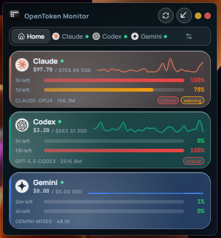
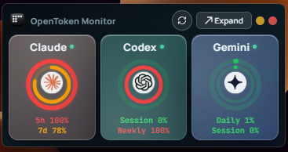

# OpenTokenMonitor

**Local-first desktop dashboard for tracking Claude, Codex, and Gemini AI usage in real time.**

[](https://tauri.app/)
[](https://react.dev/)
[](https://www.typescriptlang.org/)
[](https://www.rust-lang.org/)
[](./LICENSE)

| Dashboard | Widget |
|-----------|--------|
|  |  |

## Why

If you use Claude, Codex, and Gemini through their CLIs or APIs, your usage is scattered across multiple dashboards with different quota models. OpenTokenMonitor pulls it all into a single compact desktop widget that gives you an at-a-glance view of how much capacity you have left across all providers.

## Features

- **Unified dashboard** for Claude, Codex, and Gemini usage in one compact 360x390 window
- **Widget mode** — compact 360x182 view with Apple Activity Ring gauges and live health indicators
- **Usage bars** with color-coded indicators (green / yellow / red) showing utilization at a glance
- **Per-provider detail pages** with cost trends, model breakdowns, and threshold alerts
- **Sparkline charts** showing 30-day cost trends inline on overview cards
- **Glassmorphism UI** with provider-tinted cards, gradient accent bars, and animated health indicators
- **Keyboard shortcuts** for fast navigation (1/2/3 for providers, Ctrl+R refresh, Esc for home)
- **Local-first architecture** — reads from local CLI logs with no cloud dependency required
- **No text selection** — native desktop feel with non-selectable UI elements

## How It Works

OpenTokenMonitor has two data paths:

1. **Local file scanning** — The Rust backend watches and parses CLI history files from `~/.claude/`, `~/.codex/`, and `~/.gemini/`
2. **Live API polling** — Fetches real-time usage data from provider APIs when credentials are configured

Each provider exposes different quota models, and the app respects that honestly:

| Provider | Windows | Sources |
|----------|---------|---------|
| Claude | 5-hour rolling, 7-day rolling | Local logs, OAuth usage surface |
| Codex | Session, Weekly | Local logs, CLI auth, bearer API |
| Gemini | Daily, Session | CLI stats, local session files |

Usage accuracy is labeled transparently: `exact` for real counters, `approximate` for log-derived estimates, and `percent-only` when that's all the provider gives.

## Installation

### Download (Windows)

1. Go to the [Releases](https://github.com/Hitheshkaranth/OpenTokenMonitor/releases) page
2. Download the latest `.exe` installer (NSIS)
3. Run the installer — no admin rights required
4. Launch **OpenTokenMonitor** from the Start Menu

### Build from Source

**Prerequisites:**
- [Node.js](https://nodejs.org/) 18+ (20+ recommended)
- [Rust](https://rustup.rs/) stable toolchain
- [Tauri prerequisites](https://v2.tauri.app/start/prerequisites/) for your OS

**Development:**

```bash
git clone https://github.com/Hitheshkaranth/OpenTokenMonitor.git
cd OpenTokenMonitor
npm install
npm run tauri dev
```

**Release build (optimized, ~9MB binary, ~4MB installer):**

```bash
npm run tauri build
```

The NSIS installer is output to `src-tauri/target/release/bundle/nsis/`.

## Usage Guide

### Overview (Home)

The home screen shows all three providers as cards with:
- Provider logo and health status indicator (green = active, amber = waiting, red = error)
- Usage bars for each quota window (color transitions green -> yellow -> red)
- Inline sparkline for 30-day cost trend
- Today's cost and 30-day total
- Top model by token usage and active alert badges

Click any card to drill into detailed breakdowns.

### Widget Mode

Toggle widget mode from the header to get a compact view with:
- **Apple Activity Ring gauges** — concentric circular progress indicators for primary and secondary usage windows
- **Provider logos** centered inside each ring
- **Live health dots** — same green/amber/red indicators as the full dashboard
- **Refresh button** — refresh all providers without expanding
- **Expand button** — switch back to full dashboard

### Provider Detail

Each provider page shows:
- Usage bars with window labels, countdown timers, and detailed value breakdowns
- Cost trend area chart (30-day view with interactive tooltip)
- Per-model token usage (input, output, cache) and estimated costs
- Active threshold alerts (75%, 90%, 95%)

### Settings (Ctrl+,)

- **Theme**: System, Dark, or Light
- **Widget mode**: Toggle compact always-on-top view
- **Provider toggles**: Enable/disable individual providers
- **API keys**: Set or override auto-detected credentials
- **Refresh cadence**: Manual, 30s, 1m, 2m, 5m, or 15m

### Keyboard Shortcuts

| Key | Action |
|-----|--------|
| `1` / `2` / `3` | Jump to Claude / Codex / Gemini |
| `Escape` | Return to overview |
| `Ctrl+R` | Refresh all providers |
| `Ctrl+,` | Open settings |

## Tech Stack

| Layer | Technology |
|-------|-----------|
| Frontend | React 19, TypeScript, Zustand 5, Recharts 3 |
| Desktop | Tauri 2 (native webview, ~9MB binary, ~4MB installer) |
| Backend | Rust, Tokio, Reqwest, Rusqlite, Notify |
| Build | Vite 7 |

## Project Structure

```
src/                        # React frontend
  components/
    charts/                 # Sparkline, CostTrendChart
    glass/                  # GlassPanel, GlassButton, GlassToggle, GlassInput, GlassPill
    layout/                 # NavBar (Sidebar), WidgetMode
    meters/                 # UsageBar, UsageMeter, WindowMeter, WidgetGauge
    providers/              # OverviewCard, ProviderCard, ProviderLogo, ProviderOverview
    settings/               # SettingsPage
    states/                 # EmptyState, ErrorState, LoadingState, DiagnosticsPanel
  hooks/                    # useUsageData, useProviderStatus, useGlassTheme
  stores/                   # Zustand stores (settings, usage)
  styles/                   # sidebar.css, settings.css
  utils/                    # usageWindows, runtime detection
src-tauri/                  # Rust backend
  src/providers/            # Claude, Codex, Gemini parsers
  src/usage/                # Storage, snapshots, reports
  src/watchers/             # Filesystem watchers for live updates
public/providers/           # Provider logo assets
docs/                       # Architecture, screenshots
```

## Docs

- [Architecture](./ARCHITECTURE.md) - Technical architecture and data flow

## Limitations

- Provider precision is intentionally uneven because the providers expose different surfaces
- Gemini weekly usage is derived analytics unless Google publishes a first-class weekly quota API
- Claude and Codex subscriber windows may be percent-only even when local token accounting is exact
- Internal provider endpoints can change; the app labels provenance so the UI reflects this honestly

## License

[MIT](./LICENSE)
