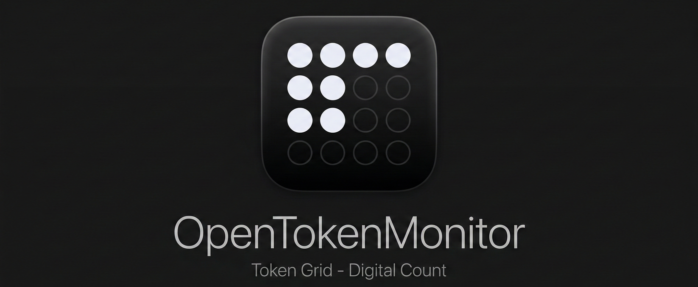
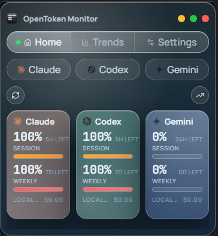

Local-first desktop monitor for Claude, Codex, and Gemini usage.

[](https://tauri.app/)
[](https://react.dev/)
[](https://www.typescriptlang.org/)
[](https://www.rust-lang.org/)
[](https://vite.dev/)
[](./LICENSE)



## Highlights

- Unified dashboard for Claude, Codex, and Gemini
- Live usage windows, trends, and cost tracking
- Local log scanning with optional API/cookie enrichment
- Native system tray + frameless desktop UI
- Built with Tauri (Windows, macOS, Linux)

## Supported Providers

- Claude CLI (Anthropic)
- Codex CLI (OpenAI)
- Gemini CLI (Google)

## Stack

- Frontend: React 19, TypeScript, Zustand, Recharts, Framer Motion, Vite
- Desktop shell: Tauri 2
- Backend: Rust, Tokio, Reqwest, Rusqlite, Notify

## Quick Start

### Prerequisites

- Node.js 18+ (20+ recommended)
- Rust stable (`rustup`)
- Tauri platform prerequisites: https://v2.tauri.app/start/prerequisites/

### Install

```bash
git clone https://github.com/side-quests/OpenTokenMonitor.git
cd OpenTokenMonitor
npm install
```

### Run

```bash
# Web UI only
npm run dev

# Desktop app (Tauri)
npm run tauri dev
```

### Build

```bash
# Frontend
npm run build

# Desktop installers/bundles
npm run tauri build
```

## Scripts

- `npm run dev` - Start Vite dev server
- `npm run build` - Type-check and build frontend
- `npm run preview` - Preview production frontend build
- `npm run tauri dev` - Run desktop app in development
- `npm run tauri build` - Build desktop installers

## Architecture

1. Rust/Tauri backend scans local provider data (`.claude`, `.codex`, `.gemini`) and keeps usage snapshots updated.
2. Provider modules merge local file parsing with optional API/cookie/CLI enrichment when available.
3. React frontend calls Tauri commands to fetch usage/status, then stores and normalizes state in Zustand.
4. UI components render provider cards, meters, countdown windows, trends, and overview panels in real time.
5. Tray integration keeps the app available in the background while preserving a lightweight desktop footprint.

Detailed notes: [ARCHITECTURE.md](./ARCHITECTURE.md)

## Build Outputs (Including Direct .exe)

After running:

```bash
npm run tauri build
```

Windows build artifacts are generated under `src-tauri/target/release/` and `src-tauri/target/release/bundle/`.

- Direct executable for immediate use: `src-tauri/target/release/*.exe`
- Installer packages (depending on target config): `src-tauri/target/release/bundle/msi/*.msi`

Use the direct `.exe` when you want to run the app immediately without installing.

## Project Layout

```text
.
|- src/                 # React UI (components, hooks, stores, styles)
|- src-tauri/           # Rust/Tauri backend
|- public/              # Static assets
|- docs/images/         # README screenshots
|- ARCHITECTURE.md      # Architecture notes
```

## Releases

https://github.com/side-quests/OpenTokenMonitor/releases

## License

MIT. See [LICENSE](./LICENSE).
