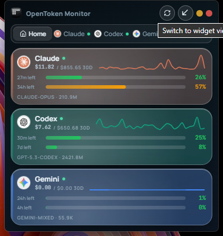
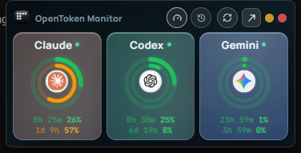
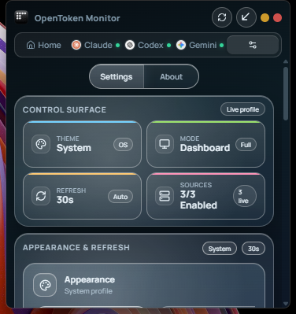
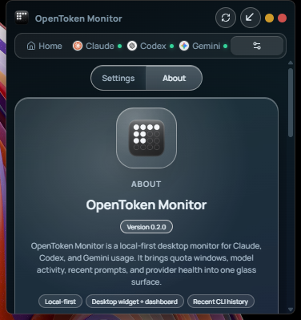

<p align="center">
  
</p>

<h1 align="center">OpenToken Monitor</h1>

<p align="center"><strong>Local-first desktop monitor for Claude, Codex, and Gemini usage.</strong></p>

<p align="center">Version 0.2.0</p>

<p align="center">
  <a href="https://tauri.app/"></a>
  <a href="https://react.dev/"></a>
  <a href="https://www.typescriptlang.org/"></a>
  <a href="https://www.rust-lang.org/"></a>
  <a href="./LICENSE"></a>
</p>

| Overview | Widget |
|---|---|
|  |  |

| Settings | About |
|---|---|
|  |  |

## What It Is

OpenToken Monitor brings provider usage, model activity, recent CLI inputs, and provider health into one compact desktop app. It is built for people who actively switch between Claude Code, Codex CLI, and Gemini CLI and want one honest surface instead of three separate dashboards.

The app is local-first. It reads local CLI history and usage artifacts where possible, then combines that with live provider fetchers when credentials are available.

## What Is New In 0.2.0

- Refreshed non-widget settings surface with a cleaner control board for appearance and refresh behavior
- Reworked About screen that now matches the rest of the glass desktop UI
- Recent local CLI inputs surfaced in both provider detail pages and widget mode
- Higher-resolution provider logos throughout the interface
- Polished widget controls for usage, recent history, refresh, and expand actions

## Core Features

- Unified monitoring for Claude, Codex, and Gemini in one desktop window
- Compact widget mode with live usage rings and a recent-inputs view
- Provider detail pages with usage windows, cost trend, model breakdowns, alerts, and recent prompts
- Settings panel for theme, refresh cadence, provider enablement, and credential entry
- About screen with project info, versioning, and repository access
- Local-first data collection with transparent provenance and mixed precision support

## Supported Providers

| Provider | CLI | Typical sources |
|---|---|---|
| Claude | [Claude Code](https://docs.anthropic.com/en/docs/claude-code) | Local logs, OAuth-backed usage fetchers |
| Codex | [Codex CLI](https://github.com/openai/codex) | Local logs, CLI auth, bearer/cookie-backed usage fetchers |
| Gemini | [Gemini CLI](https://github.com/google-gemini/gemini-cli) | Local session files, CLI stats, OAuth-backed usage fetchers |

Providers without a detected installation or usable credential source stay visible and report their state as waiting instead of failing silently.

## Screens And Workflow

### Overview

The overview shows all enabled providers in one pass with:

- health status
- current usage windows
- inline trend sparkline
- current and 30-day cost
- top model summary
- alert visibility

### Widget

Widget mode is for quick-glance monitoring. It includes:

- provider usage rings with reset countdowns
- usage and recent-inputs screens in the same compact widget
- mini refresh and expand controls
- fast provider switching inside the recent-inputs view

### Provider Detail

Each provider page includes:

- detailed usage window bars
- 30-day cost trend chart
- per-model token and cost breakdown
- recent local CLI prompts with terminal/session context
- alert list for threshold breaches

### Settings And About

The non-widget settings area includes:

- theme selection
- refresh cadence control
- provider enablement toggles
- API key entry where relevant
- About screen with version `0.2.0`, maintainer info, and GitHub repo access

### Keyboard Shortcuts

| Shortcut | Action |
|---|---|
| `1` / `2` / `3` | Jump to Claude / Codex / Gemini |
| `Escape` | Return to overview |
| `Ctrl+R` | Refresh all providers |
| `Ctrl+,` | Open settings |

## Data Model And Accuracy

OpenToken Monitor combines two kinds of data:

1. Local file scanning from CLI state in user directories such as `~/.claude`, `~/.codex`, and Gemini session/cache locations.
2. Live provider usage fetchers when the provider exposes a usable authenticated surface.

Because provider APIs are inconsistent, the app preserves source honesty in the UI. Some counters are exact, some are approximate from local logs, and some providers only expose percent-oriented usage windows.

## Installation

### Windows Release

1. Open the [latest releases](https://github.com/Hitheshkaranth/OpenTokenMonitor/releases).
2. Download `OpenTokenMonitor_0.2.0_x64-setup.exe` or the newest release asset.
3. Run the installer.
4. Launch `OpenTokenMonitor`.

### Build From Source

Prerequisites:

- Node.js 18+ (20+ recommended)
- Rust stable
- Tauri 2 prerequisites for your OS

```bash
git clone https://github.com/Hitheshkaranth/OpenTokenMonitor.git
cd OpenTokenMonitor
npm install
npm run tauri dev
```

Release build:

```bash
npm run tauri build
```

The Windows installer is generated in `src-tauri/target/release/bundle/nsis/`.

## Tech Stack

| Layer | Stack |
|---|---|
| Frontend | React 19, TypeScript, Zustand, Recharts |
| Desktop shell | Tauri 2 |
| Backend | Rust, Tokio, Reqwest, Rusqlite, Notify |
| Build | Vite 7 |

## Project Structure

```text
src/
  components/
    layout/       # Sidebar, widget mode, widget recent activity
    providers/    # Overview cards, provider detail, logos
    settings/     # Settings and About surfaces
    charts/       # Cost chart components
    meters/       # Usage bars, widget gauges, countdowns
    states/       # Empty, loading, diagnostics, error boundaries
  hooks/          # Data loading and theme hooks
  stores/         # Zustand settings and usage state
  styles/         # Glass, sidebar, settings styling

src-tauri/
  src/providers/  # Provider-specific scanners and fetchers
  src/usage/      # Aggregation, reports, persistence
  src/usage_scanners.rs
```

## Documentation

- [Architecture](./ARCHITECTURE.md)

## Repository

- GitHub: [Hitheshkaranth/OpenTokenMonitor](https://github.com/Hitheshkaranth/OpenTokenMonitor)

## License

[MIT](./LICENSE)
