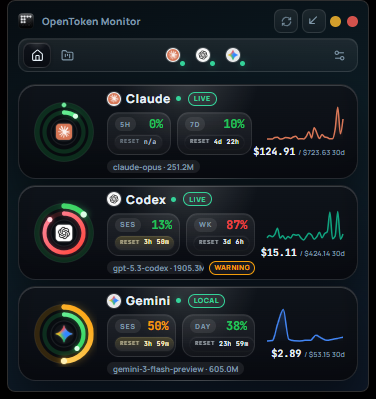
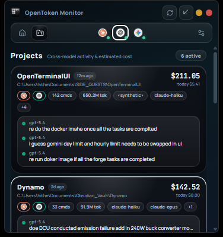
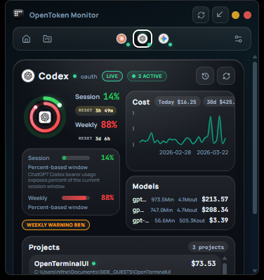
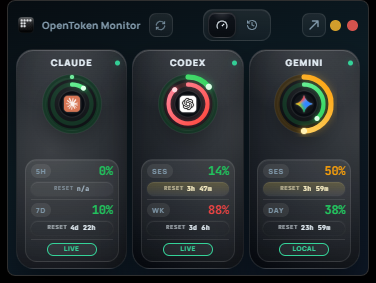
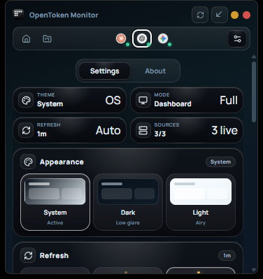

<p align="center">
  
</p>

<h1 align="center">OpenToken Monitor</h1>

<p align="center"><strong>Local-first desktop monitor for Claude, Codex, and Gemini usage.</strong></p>

<p align="center">Version 0.3.1</p>

<p align="center">
  <a href="https://tauri.app/"></a>
  <a href="https://react.dev/"></a>
  <a href="https://www.typescriptlang.org/"></a>
  <a href="https://www.rust-lang.org/"></a>
  <a href="./LICENSE"></a>
</p>

| Overview | Projects |
|---|---|
|  |  |

| Provider Detail | Widget |
|---|---|
|  |  |

| Settings |
|---|
|  |

## What It Does

OpenToken Monitor gives you one desktop surface for usage windows, recent prompts, cost trends, provider health, and cross-project activity across Claude, Codex, and Gemini.

The app is local-first. It reads local CLI/session artifacts where possible, then augments them with live provider usage fetchers when credentials are available.

## Highlights In 0.3.1

- New Projects view that groups recent activity into workspace-level cost and command summaries
- Updated dashboard flow with overview, provider detail, settings, about, and compact widget surfaces
- Stronger provider-status handling so unavailable sources remain visible instead of failing silently
- Refined startup, refresh, and theme controls in the settings surface
- Centralized app versioning and metadata cleanup across the frontend and desktop shell
- **Improved Gemini CLI Integration**: Accurately tracks tokens and estimates costs by recursively scanning local `session-*.json` telemetry logs, bypassing the need for a live API key. Status now correctly reflects "Local" rather than "Limited" when using these logs.

## Core Features

- Unified monitoring for Claude, Codex, and Gemini in one desktop app
- Dashboard overview with health, usage windows, trend summaries, and alerts
- Provider detail pages with cost history, model breakdowns, and recent activity
- Projects surface with cross-model activity, estimated token usage, and cost attribution
- Compact widget mode for quick-glance monitoring
- Local-first scanning of CLI history, sessions, and provider artifacts
- Settings for theme, refresh cadence, provider enablement, API keys, and launch at startup

## Supported Providers

| Provider | Primary source patterns |
|---|---|
| Claude | `~/.claude`, local project/session history, provider usage fetchers |
| Codex | `~/.codex`, local CLI activity, authenticated usage fetchers |
| Gemini | Gemini CLI/session files, API key support, provider usage fetchers |

If a provider is installed but not currently accessible, OpenToken Monitor keeps it visible and reports that state as waiting or error instead of hiding it.

## Screens

### Overview

The overview page is the default dashboard. It shows enabled providers, usage health, trend signals, alerts, and quick navigation into provider detail screens.

### Provider Detail

Each provider page shows usage windows, cost history, model breakdowns, recent prompts, and provider-specific alerts.

### Projects

The projects page rolls recent activity up into workspace-level cards so you can see:

- estimated spend by project
- active models and providers
- recent commands/prompts
- token and activity volume

### Widget

Widget mode condenses the app into a fixed compact surface for quick-glance monitoring, including usage rings, reset countdowns, refresh actions, and recent activity.

### Settings And About

Settings covers appearance, refresh cadence, startup behavior, provider toggles, and credential entry. The About panel surfaces project metadata, repository access, and current version information.

## Keyboard Shortcuts

| Shortcut | Action |
|---|---|
| `1` / `2` / `3` | Jump to Claude / Codex / Gemini |
| `4` | Open Projects |
| `Escape` | Return to overview |
| `Ctrl+R` / `Cmd+R` | Refresh all providers |
| `Ctrl+,` / `Cmd+,` | Open settings |

## Installation

### Build From Source

Prerequisites:

- Node.js 18+ with `npm`
- Rust stable toolchain
- Tauri 2 prerequisites for your OS

```bash
git clone https://github.com/Hitheshkaranth/OpenTokenMonitor.git
cd OpenTokenMonitor
npm install
npm run tauri dev
```

Release build:

```bash
npm run tauri build
```

macOS app bundle + installer:

```bash
npm run tauri:build:mac
```

Windows installer:

```bash
npm run tauri:build:win
```

## Tech Stack

| Layer | Stack |
|---|---|
| Frontend | React 19, TypeScript, Zustand, Recharts, Framer Motion |
| Desktop shell | Tauri 2 |
| Backend | Rust, Tokio, Reqwest, Rusqlite, Notify |
| Build | Vite 7 |

## Contributor Notes

- Architecture overview: [ARCHITECTURE.md](./ARCHITECTURE.md)
- Frontend entry: [src/App.tsx](./src/App.tsx)
- Frontend usage bridge: [src/stores/usageStore.ts](./src/stores/usageStore.ts)
- Tauri entry and commands: [src-tauri/src/lib.rs](./src-tauri/src/lib.rs)

## License

[MIT](./LICENSE)
