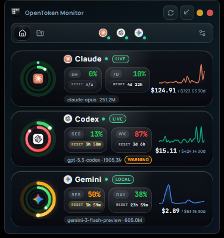
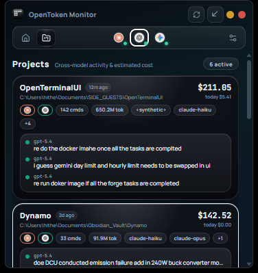
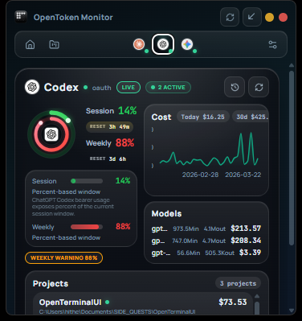
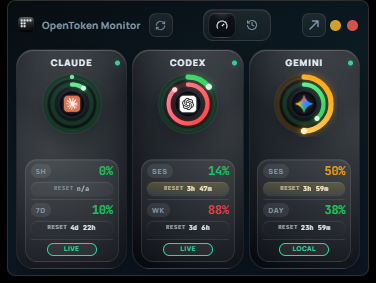
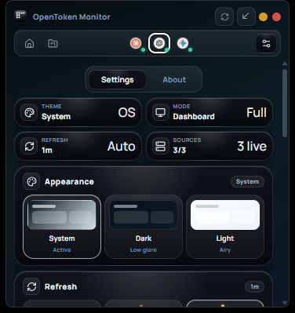

<div align="center">


# OpenToken Monitor

**The unified, local-first desktop monitor for Claude, Codex, and Antigravity.**

One window for every usage gauge, cost trend, and recent prompt — without handing your keys to a SaaS dashboard.

[](https://tauri.app/)
[](https://www.rust-lang.org/)
[](https://react.dev/)
[](https://www.typescriptlang.org/)
[](https://vitejs.dev/)
[](https://www.sqlite.org/)

[](./LICENSE)
[](https://github.com/Hitheshkaranth/OpenTokenMonitor/releases)
[](#-installation)
[](#-data--privacy)

[Download](#-installation) ·
[Features](#-features) ·
[Screens](#-screens) ·
[Architecture](./ARCHITECTURE.md) ·
[Contributing](#-contributing)

</div>

---

## ✨ Why OpenToken Monitor?

You're juggling **three coding agents** at once — Claude, Codex, and Antigravity — each with its own dashboard, its own quota window, and its own pricing page. OpenToken Monitor stitches them into a **single tray-resident desktop app** that:

- 📊 reads your **local CLI artifacts first** (`~/.claude`, `~/.codex`, `~/Library/Application Support/Antigravity/logs`)
- 🔐 augments them with **live OAuth fetches** when credentials are present — never proxied through a third party
- 💸 computes **accurate per-model cost** using published list rates, reviewed September 2026
- 🛟 keeps providers **visible even when offline**, surfacing health status instead of silently dropping them

Everything stays on your machine. Snapshots persist in a local SQLite store; nothing leaves the device.

---

## 🚀 Features

### 🎯 Core Dashboard

- **Unified overview** — Claude · Codex · Antigravity in one glance, with live usage rings, trend sparklines, and provider health badges
- **Per-provider detail pages** with cost history, model breakdowns, alert thresholds (75 % / 90 % / 95 %), and recent-prompt activity
- **Projects view** — recent activity rolled up by workspace with cross-model spend attribution and command summaries
- **Compact widget mode** — fixed-size always-on-top panel for at-a-glance gauges and reset countdowns

### 🔌 Provider Intelligence

| Provider | Sources | Windows tracked |
|---|---|---|
| **Claude** | Anthropic OAuth usage API + `~/.claude/projects` local logs | 5-hour rolling, 7-day, Opus weekly, extra-credits |
| **Codex (OpenAI)** | Bearer / cookie / RPC fetchers + `~/.codex/sessions` | Daily, model breakdown |
| **Antigravity** | Google Cloud Code API (OAuth) + Local Language Server loopback + `~/Library/Application Support/Antigravity/logs` | 5-hour rolling, Daily request cap |

### 🛡️ Resilience Built-In

- **Smart OAuth backoff** — separate cooldowns for success (120 s) and failure (25 s), so one transient 429 doesn't pin Claude to local-mode for two minutes
- **Stale-cache fallback** — last good snapshot stays on screen marked `stale` if a fetch fails
- **Reactive file watching** — `notify` watchers refresh the affected provider the moment a CLI session file changes
- **Single-instance enforcement** — autostart launch + manual click no longer fight over the SQLite store
- **Bundled WebView2 bootstrapper** — Windows MSI installs cleanly on machines without WebView2 pre-installed

### 💰 Accurate Cost Estimation (rates reviewed September 2026)

All model rates live in a single source-of-truth: [`src-tauri/src/pricing.rs`](./src-tauri/src/pricing.rs).
Rates are version-aware — Opus 4.1 and Opus 4.5 are priced differently, and the
model id from your local logs keeps its version digits so the right tier is used.

| Family | Tier | Rate (input / output per 1M tokens) |
|---|---|---|
| Claude | Fable / Mythos 5.x | $10.00 / $50.00 |
| Claude | Opus 4.5 · 4.6 · 4.7 · 4.8 · 5 | $5.00 / $25.00 |
| Claude | Opus 4 · 4.1 (legacy) | $15.00 / $75.00 |
| Claude | Sonnet 5 | $2.00 / $10.00 |
| Claude | Sonnet 4 · 4.5 · 4.6 | $3.00 / $15.00 |
| Claude | Haiku 4.5 | $1.00 / $5.00 |
| OpenAI | GPT-6 | $10.00 / $50.00 |
| OpenAI | GPT-5.5 · 5.5 Pro | $5.00 / $30.00 · $30.00 / $180.00 |
| OpenAI | GPT-5.2 · 5.3-codex | $1.75 / $14.00 |
| OpenAI | GPT-5 · 5.1 | $1.25 / $10.00 |
| OpenAI | GPT-5 mini / nano | $0.25 / $2.00 · $0.05 / $0.40 |
| OpenAI | o3 / o4-mini | $2.00 / $8.00 · $1.10 / $4.40 |
| Antigravity | 3.x Pro | $2.00 / $12.00 |
| Antigravity | 3.6–3.8 Flash | $0.75 / $3.75 |
| Antigravity | 2.5 Pro / Flash / Flash-Lite | $1.25 / $10.00 · $0.30 / $2.50 · $0.10 / $0.40 |

Caching discounts and cache-write surcharges are applied where each provider exposes them.
Antigravity's 3.6–3.8 Flash input rate is promotional and doubles on 2027-01-01.

### ⌨️ Keyboard Shortcuts

| Shortcut | Action |
|---|---|
| <kbd>1</kbd> / <kbd>2</kbd> / <kbd>3</kbd> | Jump to Claude / Codex / Antigravity |
| <kbd>4</kbd> | Open Projects |
| <kbd>Esc</kbd> | Return to overview |
| <kbd>Ctrl</kbd>+<kbd>R</kbd> / <kbd>⌘</kbd>+<kbd>R</kbd> | Refresh all providers |
| <kbd>Ctrl</kbd>+<kbd>,</kbd> / <kbd>⌘</kbd>+<kbd>,</kbd> | Open settings |

---

## 📸 Screens

| Overview | Projects |
|---|---|
|  |  |

| Provider Detail | Widget Mode |
|---|---|
|  |  |

| Settings |
|---|
|  |

---

## 📦 Installation

### Pre-built binaries

Grab the latest installer for your OS from [GitHub Releases](https://github.com/Hitheshkaranth/OpenTokenMonitor/releases/latest):

[](https://github.com/Hitheshkaranth/OpenTokenMonitor/releases/latest)
[](https://github.com/Hitheshkaranth/OpenTokenMonitor/releases/latest)
[](https://github.com/Hitheshkaranth/OpenTokenMonitor/releases/latest)
[](https://github.com/Hitheshkaranth/OpenTokenMonitor/releases/latest)

#### First launch on macOS

Release builds are signed with a Developer ID certificate and notarized by Apple,
so they open normally. If you built from source yourself, the bundle is ad-hoc
signed and macOS will say it *"cannot verify the developer"* — right-click the app
and choose **Open**, then **Open** again in the dialog. You only need to do this once.

#### First launch on Windows

If SmartScreen shows **"Windows protected your PC"**, click **More info → Run anyway**.
This appears on installers whose signing certificate has not yet accumulated
download reputation with Microsoft, and it disappears as the release matures.
The installer runs per-user and does not ask for administrator rights.

### Build from source

> **Prerequisites:** Node.js 18+, Rust stable, and your OS-specific [Tauri 2 dependencies](https://tauri.app/start/prerequisites/).

```bash
# Clone & install
git clone https://github.com/Hitheshkaranth/OpenTokenMonitor.git
cd OpenTokenMonitor
npm install

# Run in dev mode (hot-reload)
npm run tauri dev

# Production build
npm run tauri build              # all platforms
npm run tauri:build:win          # Windows NSIS installer
npm run tauri:build:mac          # macOS app bundle + installer
```

---

## 🧱 Tech Stack

<table>
<tr>
<td valign="top" width="50%">

### 🦀 Backend (Rust)

- [**Tauri 2**](https://tauri.app/) — desktop shell & IPC
- [**Tokio**](https://tokio.rs/) — async runtime
- [**Reqwest**](https://github.com/seanmonstar/reqwest) — HTTPS with rustls
- [**Rusqlite**](https://github.com/rusqlite/rusqlite) — bundled SQLite persistence
- [**Notify**](https://github.com/notify-rs/notify) — filesystem watchers
- [**Chrono · Serde · Async-trait**](https://crates.io)
- `tauri-plugin-single-instance`, `tauri-plugin-autostart`

</td>
<td valign="top" width="50%">

### ⚛️ Frontend (TypeScript)

- [**React 19**](https://react.dev/) — UI runtime
- [**Zustand**](https://zustand-demo.pmnd.rs/) — store layer
- [**Recharts**](https://recharts.org/) — usage trend graphs
- [**Framer Motion**](https://www.framer.com/motion/) — micro-interactions
- [**Lucide React**](https://lucide.dev/) — icon set
- [**Vite 7**](https://vitejs.dev/) — bundler
- [**Tailwind**](https://tailwindcss.com/) — utility styling

</td>
</tr>
</table>

---

## 🏗️ Architecture

```
┌──────────────────────────────────────────────────────────┐
│  React 19  ·  Zustand stores  ·  hooks (resize / kbd)    │
└──────────────────┬───────────────────────────────────────┘
                   │  Tauri invoke()  /  usage-updated event
┌──────────────────┴───────────────────────────────────────┐
│  commands.rs  →  aggregator  →  provider registry        │
│         │                          ├─ Claude  (OAuth + logs)
│         │                          ├─ Codex   (bearer/cookie/RPC + logs)
│         │                          ├─ Antigravity (OAuth + Live Loopback + logs)
│         ↓                                                │
│  UsageStore (SQLite)  ·  pricing.rs  ·  alerts.rs        │
│  tray.rs  ·  watchers (poll + filesystem)                │
└──────────────────────────────────────────────────────────┘
```

Full module map and data-flow walkthrough → [**ARCHITECTURE.md**](./ARCHITECTURE.md)

Key entry points:

- 🚪 Frontend root — [`src/App.tsx`](./src/App.tsx)
- 🔌 Backend entry — [`src-tauri/src/lib.rs`](./src-tauri/src/lib.rs)
- 📞 Tauri commands — [`src-tauri/src/commands.rs`](./src-tauri/src/commands.rs)
- 💱 Cost rate tables — [`src-tauri/src/pricing.rs`](./src-tauri/src/pricing.rs)
- 🗄️ SQLite layer — [`src-tauri/src/usage/store.rs`](./src-tauri/src/usage/store.rs)

---

## 🔒 Data & Privacy

- 🏠 **100 % local.** All snapshots, costs, and recent activity are stored in a local SQLite file under your OS app-data directory.
- 🔑 **Credentials never leave the device.** OAuth tokens are read from the official CLI keychain entries; API requests go directly from your machine to Anthropic / OpenAI / Antigravity.
- 🚫 **No telemetry.** No analytics, no crash reporting, no phone-home.
- 🔤 **Fonts are bundled, not fetched.** Manrope and JetBrains Mono ship inside the
  app (`public/fonts/`). Nothing is loaded from Google Fonts or any other CDN.
- 🔍 **Verify it yourself.** Point a network monitor at the app. The only outbound
  connections are `api.anthropic.com`, `chatgpt.com`, `auth.openai.com`, and —
  only when you have the auto-updater configured — GitHub Releases. The webview
  is additionally locked down by a [Content Security Policy](./src-tauri/tauri.conf.json)
  that permits exactly those hosts.
- 🧹 **Reset by deleting** the app-data SQLite file (`%APPDATA%\com.opentokenmonitor.desktop\usage.db` on Windows; equivalents on macOS / Linux).

---

## 🗺️ Roadmap

- [ ] Per-project budget alerts with native notifications
- [ ] Export usage reports to CSV / JSON / PDF
- [ ] Custom refresh cadences per provider
- [ ] Cursor / Aider / Continue.dev provider adapters
- [ ] Multi-month spend forecasting

Have a request? [Open an issue](https://github.com/Hitheshkaranth/OpenTokenMonitor/issues/new).

---

## 🤝 Contributing

Contributions are welcome — start with the architecture map and pricing module:

1. Read [`ARCHITECTURE.md`](./ARCHITECTURE.md) for the module layout.
2. For new providers: implement the `UsageProvider` trait in `src-tauri/src/providers/<name>/` and register it in `registry.rs`.
3. For pricing updates: edit `src-tauri/src/pricing.rs` and bump the review-date stamp at the top of the file.
4. Run the test suite before opening a PR:

```bash
cd src-tauri && cargo test --lib
npx tsc --noEmit
```

---

## 📜 License

Released under the [MIT License](./LICENSE) — free for personal and commercial use.

---

<div align="center">

**Built with ❤️ for developers who use more than one AI agent.**

OpenTokenMonitor is not affiliated with Anthropic, OpenAI, or Google.

[⬆ Back to top](#opentoken-monitor)

</div>
