<div align="center">

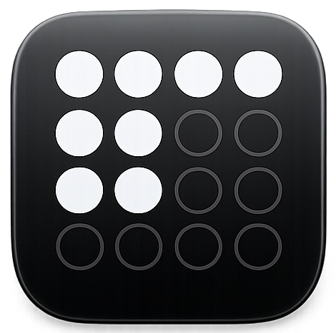

# OpenToken Monitor

### Every AI coding quota, in your menu bar.

Live usage limits, exact per-project costs, and time-to-limit alerts for **Claude Code**, **Codex**, and **Antigravity** — read from your own machine, never a SaaS dashboard.

[](https://github.com/Hitheshkaranth/OpenTokenMonitor/releases)
[](./LICENSE)
[](#-install)
[](#-privacy)
[](https://tauri.app/)
[](https://www.rust-lang.org/)
[](https://react.dev/)

[**Download**](https://github.com/Hitheshkaranth/OpenTokenMonitor/releases/latest) ·
[What it does](#-what-it-does) ·
[Features](#-features) ·
[How it works](#-how-it-works) ·
[Privacy](#-privacy) ·
[FAQ](#-faq)

<br/>

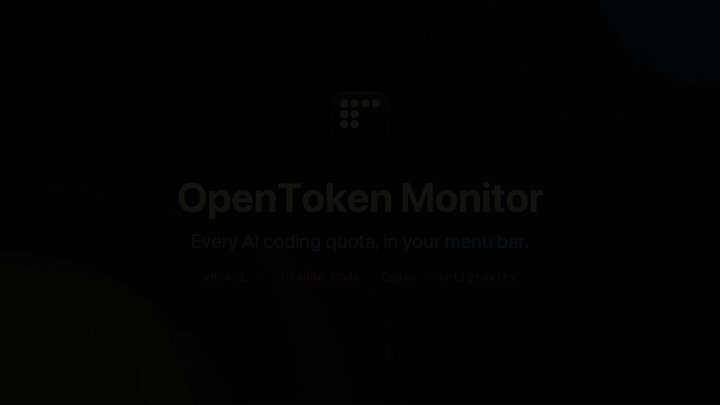

<sub>30 seconds of v0.4.1 on macOS, running on real usage.</sub>

</div>

---

## 🎯 What it does

You run more than one coding agent. Each has its own quota window, its own reset timer and its own pricing page, and none of them tells you *you're about to hit the wall* until you do. OpenToken Monitor watches all of them from your menu bar.

Here is what the demo above walks through:

1. **Rings in the menu bar.** Each provider gets its logo wrapped in two usage rings: the outer ring is its primary window (Claude 5-hour, Codex session, Antigravity 5-hour), the inner ring its secondary window (Claude 7-day, Codex weekly, Antigravity daily). They turn green → amber → red as you burn through them, so a glance is usually enough.
2. **Click a ring to open that provider.** You land on its detail page: every quota window with a reset countdown, a **FULL IN** forecast when your current pace will hit 100 % before the reset, today's and 30-day cost, cache-hit rate and how much prompt caching saved you.
3. **Overview.** Claude Code, Codex and Antigravity side by side, with live/local status, usage and a cost sparkline for each.
4. **Projects.** Exact spend per working directory and per CLI session, read from the session logs your CLIs already write.
5. **Compare.** Spend share across providers plus side-by-side usage, spend, tokens and burn.
6. **All of it local.** The numbers are computed on your machine from your own logs and your CLIs' own sign-ins. No account, no telemetry, no proxy.

When the window is closed, the app keeps working in the background: the rings stay current and **alerts** fire before a window fills or a budget overruns.

### Get started in a minute

1. **[Download](https://github.com/Hitheshkaranth/OpenTokenMonitor/releases/latest)** the installer for macOS, Windows or Linux ([details](#-install)).
2. **Use the CLIs you already have.** Sign in to `claude`, `codex` or Antigravity as usual; OpenToken Monitor finds their logs and credentials on its own.
3. **Look at your menu bar.** The rings appear on first launch. There is nothing to configure.

---

## 🚀 Features

<table>
<tr>
<td width="50%" valign="top">

### 📊 Live limits
- Claude **5-hour, 7-day and Opus** windows, Codex **session and weekly**, Antigravity **5-hour and daily**
- Reset countdowns on every window
- **Menu-bar ring badges** per provider, colour-coded green → amber → red
- Compact always-on-top **widget mode**

</td>
<td width="50%" valign="top">

### ⏱️ Time-to-limit forecast
- Fits your burn rate over the last 30 minutes
- A **FULL IN** pill appears only when a window will hit 100 % *before* it resets
- Works on every window, including weekly quotas

</td>
</tr>
<tr>
<td valign="top">

### 💸 Exact costs
- Per **project** (by working directory) and per **session**, from Claude and Codex logs
- Per-model breakdown with version-aware list prices
- **Cache-hit rate** and how much prompt caching saved you
- Model spend mix, and a 7 / 30 / 90-day or custom period

</td>
<td valign="top">

### 🔔 Alerts that respect you
- Desktop notifications raised by the background service — they work with the window closed
- Fire **once per escalation** (warning → high → critical), re-arm on reset
- Pace warnings and **projected budget overruns**
- Per-provider thresholds, budgets and refresh cadence

</td>
</tr>
<tr>
<td valign="top">

### 🧭 Compare
- Spend share across providers at a glance
- Side-by-side usage, spend, tokens and burn

</td>
<td valign="top">

### 📤 Export
- Usage reports as **CSV**, **JSON**, or printable **HTML/PDF**

</td>
</tr>
</table>

---

## 🧠 How it works

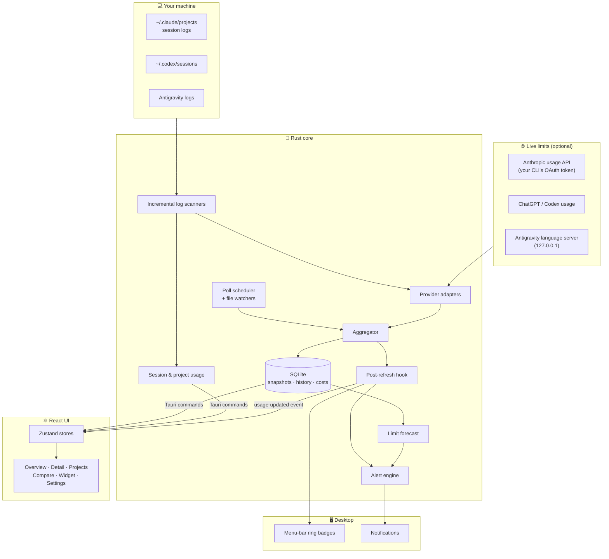
```mermaid
flowchart TB
  subgraph SRC["💻 Your machine"]
    direction LR
    CL["~/.claude/projects<br/>session logs"]
    CX["~/.codex/sessions"]
    AG["Antigravity logs"]
  end

  subgraph LIVE["🌐 Live limits (optional)"]
    direction LR
    AN["Anthropic usage API<br/>(your CLI's OAuth token)"]
    OA["ChatGPT / Codex usage"]
    LS["Antigravity language server<br/>(127.0.0.1)"]
  end

  subgraph CORE["🦀 Rust core"]
    direction TB
    TRG["Poll scheduler<br/>+ file watchers"]
    SCN["Incremental log scanners"]
    PRV["Provider adapters"]
    AGG["Aggregator"]
    DB[("SQLite<br/>snapshots · history · costs")]
    FC["Limit forecast"]
    SES["Session & project usage"]
    HOOK["Post-refresh hook"]
    ALR["Alert engine"]
  end

  subgraph UI["⚛️ React UI"]
    direction LR
    STO["Zustand stores"]
    VIEWS["Overview · Detail · Projects<br/>Compare · Widget · Settings"]
  end

  subgraph DESK["🖥️ Desktop"]
    direction LR
    BAR["Menu-bar ring badges"]
    NOTE["Notifications"]
  end

  SRC --> SCN --> PRV
  LIVE --> PRV
  TRG --> AGG
  PRV --> AGG --> DB
  DB --> FC
  SCN --> SES
  AGG --> HOOK
  HOOK --> BAR
  HOOK --> ALR --> NOTE
  FC --> ALR
  DB -- "Tauri commands" --> STO
  SES -- "Tauri commands" --> STO
  HOOK -- "usage-updated event" --> STO
  STO --> VIEWS
```

1. **Collect.** Scanners read the CLIs' own session logs incrementally (only new bytes are parsed). When your CLI is signed in, the matching adapter also fetches the live quota — using the token the CLI already stored, never one you paste in.
2. **Store.** Each refresh writes the latest snapshot, a utilization history point, and daily per-model costs to a local SQLite file.
3. **Derive.** The forecast fits a line through the last 30 minutes of history; sessions are rolled up into projects by working directory; costs use the rate tables in [`pricing.rs`](./src-tauri/src/pricing.rs).
4. **Surface.** One post-refresh hook updates the menu-bar badges, evaluates alerts, and tells the UI to re-render — whichever path triggered the refresh (timer, file change, or you).

> Full module map and data flow → [**ARCHITECTURE.md**](./ARCHITECTURE.md)

### Data sources

| Provider | Live limits | Local history | Windows |
|---|---|---|---|
| **Claude Code** | Anthropic usage API via the Claude CLI's OAuth token | `~/.claude/projects/**/*.jsonl` | 5-hour, 7-day, Opus weekly, extra credits |
| **Codex** | ChatGPT usage via the Codex CLI's credentials (bearer → cookie → `codex` RPC) | `~/.codex/sessions/**/*.jsonl` | Session, weekly |
| **Antigravity** | Local Antigravity language server on `127.0.0.1` | Antigravity log directory | 5-hour, daily request cap |

When a live fetch fails, the last good snapshot stays on screen marked *stale*, and the provider falls back to local logs.

---

## 📸 Screens

<p align="center">
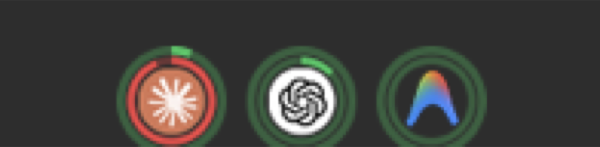
<br/>
<sub>Each provider's logo sits inside its usage rings — outer ring: primary window (Claude 5-hour), inner ring: secondary window (Claude 7-day). Click a ring to open that provider.</sub>
</p>

<table>
  <tr>
    <td align="center" width="33%">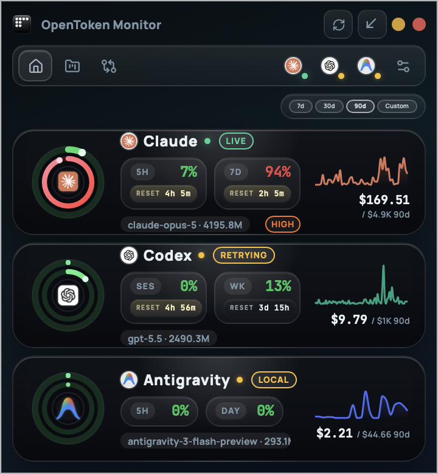<br/><b>Overview</b><br/><sub>every provider at a glance</sub></td>
    <td align="center" width="33%">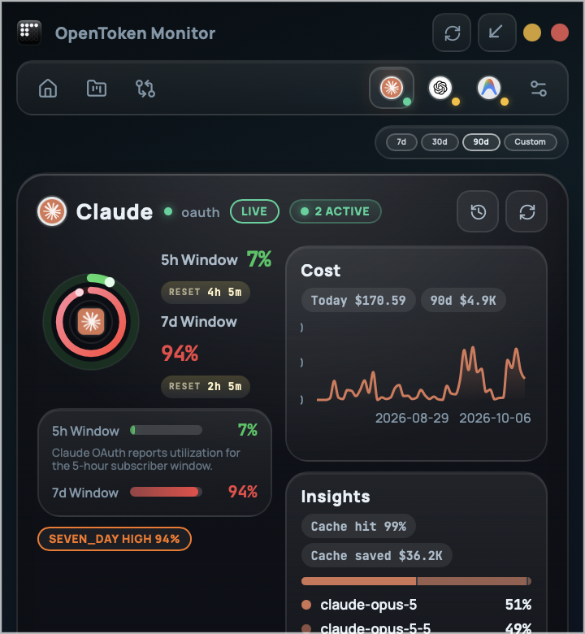<br/><b>Provider detail</b><br/><sub>windows, resets, forecast, cost</sub></td>
    <td align="center" width="33%">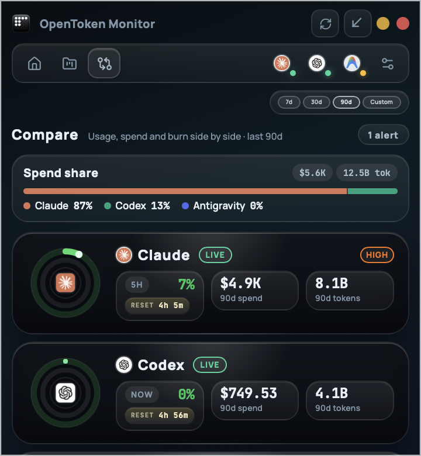<br/><b>Compare</b><br/><sub>spend share and burn side by side</sub></td>
  </tr>
  <tr>
    <td align="center" width="33%">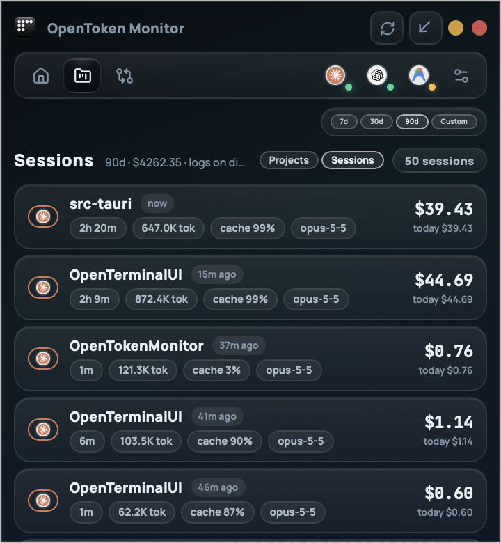<br/><b>Sessions</b><br/><sub>exact cost per CLI session</sub></td>
    <td align="center" width="33%">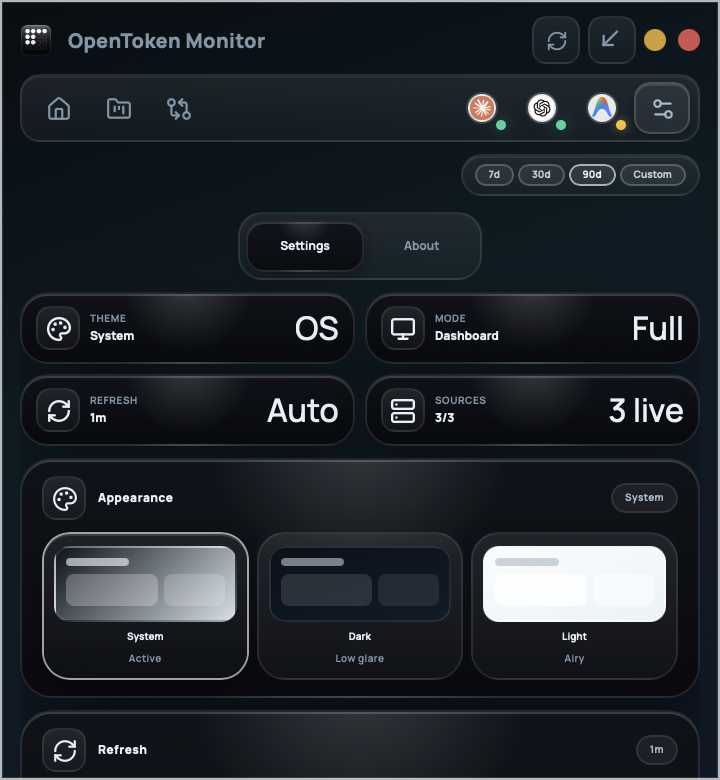<br/><b>Settings</b><br/><sub>theme, refresh, alerts, budgets, menu bar</sub></td>
    <td align="center" width="33%">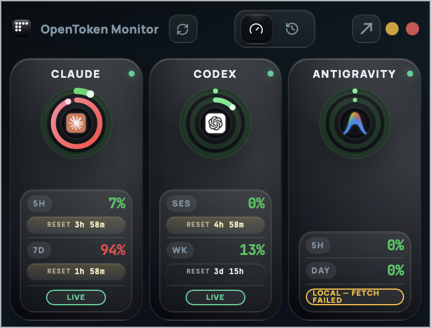<br/><b>Widget mode</b><br/><sub>always-on-top gauges</sub></td>
  </tr>
  <tr>
    <td align="center" colspan="2">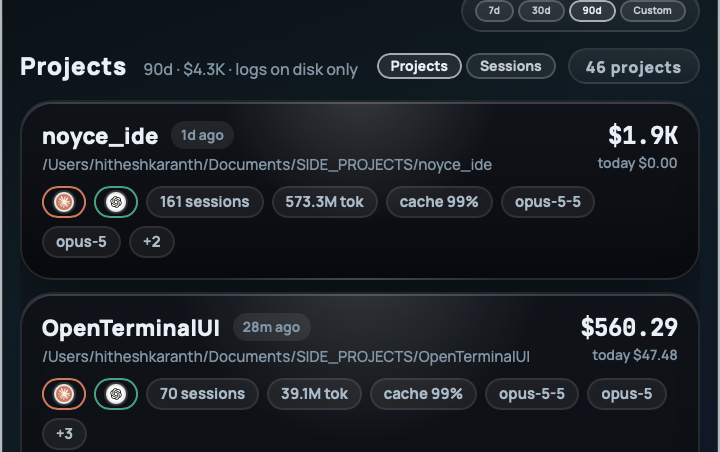<br/><b>Projects</b><br/><sub>spend by working directory across Claude and Codex</sub></td>
    <td align="center">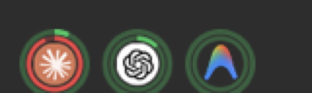<br/><b>Menu-bar badges</b><br/><sub>logo + usage rings</sub></td>
  </tr>
</table>

<details>
<summary><b>The full menu bar</b></summary>
<br/>

</details>

<details>
<summary><b>The Windows taskbar</b></summary>
<br/>
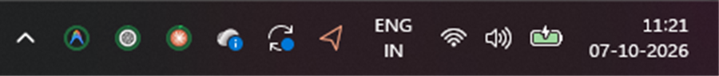
</details>

---

## 📦 Install

Grab the installer for your OS from **[GitHub Releases](https://github.com/Hitheshkaranth/OpenTokenMonitor/releases/latest)**:

[](https://github.com/Hitheshkaranth/OpenTokenMonitor/releases/latest)
[](https://github.com/Hitheshkaranth/OpenTokenMonitor/releases/latest)
[](https://github.com/Hitheshkaranth/OpenTokenMonitor/releases/latest)
[](https://github.com/Hitheshkaranth/OpenTokenMonitor/releases/latest)

Then just sign in to the CLIs you already use (`claude`, `codex`, Antigravity). OpenToken Monitor finds their logs and credentials on its own — there is nothing to configure.

<details>
<summary><b>First launch on macOS</b></summary>

The macOS builds are not notarized by Apple yet, so the first launch is blocked with *"cannot verify the developer"* (or *"is damaged"* on newer macOS). Either open **System Settings → Privacy & Security** and click **Open Anyway**, or run:

```bash
xattr -dr com.apple.quarantine /Applications/OpenTokenMonitor.app
```

You only need to do this once per install.
</details>

<details>
<summary><b>First launch on Windows</b></summary>

If SmartScreen shows **"Windows protected your PC"**, click **More info → Run anyway**. This appears while a new signing certificate builds download reputation with Microsoft. The installer is per-user and does not ask for administrator rights.
</details>

<details>
<summary><b>Build from source</b></summary>

> **Prerequisites:** Node.js 18+, Rust stable, and the [Tauri 2 dependencies](https://tauri.app/start/prerequisites/) for your OS.

```bash
git clone https://github.com/Hitheshkaranth/OpenTokenMonitor.git
cd OpenTokenMonitor
npm install

npm run tauri dev            # run with hot reload
npm run tauri build          # production build for this platform
npm run tauri:build:win      # Windows NSIS installer
npm run tauri:build:mac      # macOS app bundle + installer
```
</details>

---

## ⌨️ Usage

| Action | How |
|---|---|
| Open a provider | Click its ring in the menu bar, or press <kbd>1</kbd> / <kbd>2</kbd> / <kbd>3</kbd> |
| Projects & sessions | <kbd>4</kbd> |
| Back to overview | <kbd>Esc</kbd> |
| Refresh everything | <kbd>⌘</kbd>/<kbd>Ctrl</kbd> + <kbd>R</kbd> |
| Settings | <kbd>⌘</kbd>/<kbd>Ctrl</kbd> + <kbd>,</kbd> |
| Show / hide, refresh, quit | Right-click the menu-bar item |

**Menu-bar modes** (Settings → Menu bar): *Usage %* shows the ring badges, *Today's cost* adds today's spend beside them, *Off* keeps the plain app icon.

---

## 🔒 Privacy

- 🏠 **100 % local.** Snapshots, history and costs live in a SQLite file in your OS app-data folder.
- 🔑 **Your CLIs' credentials, read-only.** Tokens are read from where `claude` and `codex` already keep them; requests go straight from your machine to the provider.
- 🚫 **No telemetry**, no analytics, no crash reporting.
- 🔤 **No CDN.** Fonts ship inside the app.
- 🔍 **Verify it.** The only outbound hosts are `api.anthropic.com`, `chatgpt.com` and `auth.openai.com` (plus GitHub Releases if you enable the updater). Antigravity is read from a server on `127.0.0.1`. The webview's [Content Security Policy](./src-tauri/tauri.conf.json) enforces the same list.
- 🧹 **Reset** by deleting `usage.db` from the app-data folder (`%APPDATA%\com.opentokenmonitor.desktop\` on Windows, `~/Library/Application Support/com.opentokenmonitor.desktop/` on macOS).

---

## ❓ FAQ

<details>
<summary><b>Are the costs what I actually pay?</b></summary>

They are **API list-price equivalents**: what the same tokens would cost on the pay-as-you-go API, including cache discounts and cache-write surcharges. On a Pro/Max/Plus subscription you pay a flat fee, so treat the number as the value you're getting. Rates live in one file, [`pricing.rs`](./src-tauri/src/pricing.rs), with a review date at the top.
</details>

<details>
<summary><b>Why do project totals stop at about 30 days?</b></summary>

Claude Code deletes session logs older than 30 days by default. Daily totals are kept in OpenToken Monitor's own database, but older spend can no longer be split by project. The Projects header says so when your period is longer than 30 days.
</details>

<details>
<summary><b>I don't see the badges in my menu bar.</b></summary>

macOS hides the left-most status items when the menu bar is full — on MacBooks, behind the notch. Hold <kbd>⌘</kbd> and drag the OpenToken Monitor item further right, or remove a few other items.
</details>

<details>
<summary><b>How is "FULL IN" calculated?</b></summary>

A least-squares fit of the window's utilization over the last 30 minutes of the current reset cycle (at least 3 samples spanning 5 minutes). The pill only appears when the projected time to 100 % is shorter than the time to reset.
</details>

<details>
<summary><b>Does it work on Windows and Linux?</b></summary>

Yes — dashboard, widget, alerts and exports all work. On Windows each provider gets its own ring badge in the taskbar, next to the clock and battery; the app moves them out of the hidden-icons flyout on first launch (if you hide one yourself, that choice is kept). Tray titles are a macOS feature, so *Today's cost* in the tray is macOS-only.
</details>

<details>
<summary><b>Model rates (reviewed September 2026)</b></summary>

| Family | Tier | Input / output per 1M tokens |
|---|---|---|
| Claude | Fable / Mythos 5.x | $10.00 / $50.00 |
| Claude | Opus 4.5 · 4.6 · 4.7 · 4.8 · 5 | $5.00 / $25.00 |
| Claude | Opus 4 · 4.1 (legacy) | $15.00 / $75.00 |
| Claude | Sonnet 5 | $2.00 / $10.00 |
| Claude | Sonnet 4 · 4.5 · 4.6 | $3.00 / $15.00 |
| Claude | Haiku 4.5 | $1.00 / $5.00 |
| OpenAI | GPT-6 | $10.00 / $50.00 |
| OpenAI | GPT-5.5 · 5.5 Pro | $5.00 / $30.00 · $30.00 / $180.00 |
| OpenAI | GPT-5.2 · 5.3-codex | $1.75 / $14.00 |
| OpenAI | GPT-5 · 5.1 | $1.25 / $10.00 |
| OpenAI | GPT-5 mini / nano | $0.25 / $2.00 · $0.05 / $0.40 |
| OpenAI | o3 / o4-mini | $2.00 / $8.00 · $1.10 / $4.40 |
| Antigravity | 3.x Pro | $2.00 / $12.00 |
| Antigravity | 3.6–3.8 Flash | $0.75 / $3.75 |
| Antigravity | 2.5 Pro / Flash / Flash-Lite | $1.25 / $10.00 · $0.30 / $2.50 · $0.10 / $0.40 |

Antigravity's 3.6–3.8 Flash input rate is promotional and doubles on 2027-01-01.
</details>

---

## 🧱 Built with

**Rust** — [Tauri 2](https://tauri.app/) · [Tokio](https://tokio.rs/) · [Reqwest](https://github.com/seanmonstar/reqwest) (rustls) · [Rusqlite](https://github.com/rusqlite/rusqlite) (bundled SQLite) · [Notify](https://github.com/notify-rs/notify) · [image](https://github.com/image-rs/image)
**TypeScript** — [React 19](https://react.dev/) · [Zustand](https://zustand-demo.pmnd.rs/) · [Recharts](https://recharts.org/) · [Framer Motion](https://www.framer.com/motion/) · [Lucide](https://lucide.dev/) · [Vite 7](https://vitejs.dev/)

---

## 🗺️ Roadmap

- [x] Budget alerts with native notifications
- [x] Export to CSV / JSON / PDF
- [x] Per-provider refresh cadence and thresholds
- [x] Time-to-limit forecasting
- [x] Exact per-project and per-session costs
- [x] Menu-bar ring badges
- [ ] Keep project history beyond Claude Code's 30-day log cleanup
- [ ] Claude Code statusline integration and a local CLI / JSON state file
- [x] Per-provider tray badges on Windows
- [ ] Per-provider tray badges on Linux
- [ ] OpenCode, Gemini CLI, Copilot CLI and Cursor adapters

Have an idea? [Open an issue](https://github.com/Hitheshkaranth/OpenTokenMonitor/issues/new).

---

## 🤝 Contributing

1. Read [ARCHITECTURE.md](./ARCHITECTURE.md) for the module map.
2. **New provider:** implement the `UsageProvider` trait in `src-tauri/src/providers/<name>/` and register it in `registry.rs`.
3. **Pricing update:** edit `src-tauri/src/pricing.rs` and bump the review date at the top.
4. Before opening a PR:

```bash
cargo fmt   --manifest-path src-tauri/Cargo.toml --all -- --check
cargo clippy --manifest-path src-tauri/Cargo.toml --all-targets -- -D warnings -A unused-mut
cargo test  --manifest-path src-tauri/Cargo.toml
npm run build
```

---

<div align="center">

Released under the [MIT License](./LICENSE).

**Built for developers who use more than one AI agent.**
OpenToken Monitor is not affiliated with Anthropic, OpenAI, or Google.

[⬆ Back to top](#opentoken-monitor)

</div>
